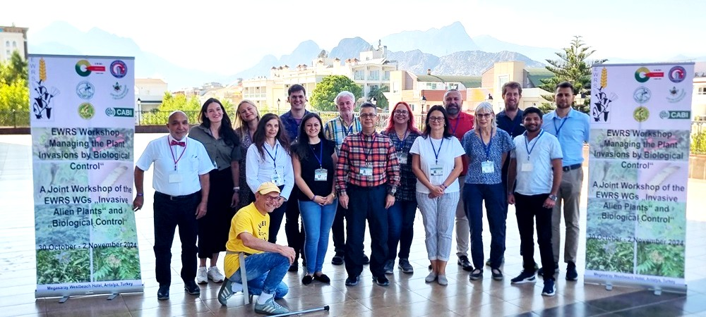

Exerpt from the [meeting Proceedings](https://ewrs.org/db/upload/documents/WGs/Biological_Control/Proceedings_Antalya_Final.pdf){target="_blank"}:

> This workshop focused on two key areas: the current state and future directions of the invasive alien plants research and control, as well as the role biological control can play within that framework. Through scientific presentations and open discussions, participants explored how our joint expertise can contribute to sustainable solutions and how future collaborative efforts might be shaped.

EWRS Workshop "Managing the Plant Invasions by Biological Control"; 30 October-02 November 2024 in Antalya, Turkey: 

[CABI blog write-up](https://blog.invasive-species.org/2024/12/23/european-weed-research-society-working-groups-turn-focus-on-biological-control-of-invasive-alien-plant-species/){target="_blank"}

[{width="90%" fig-alt="participants standing in front of banner with mountains in the background."}](https://blog.invasive-species.org/2024/12/23/european-weed-research-society-working-groups-turn-focus-on-biological-control-of-invasive-alien-plant-species/)

<!--Include social share buttons-->


