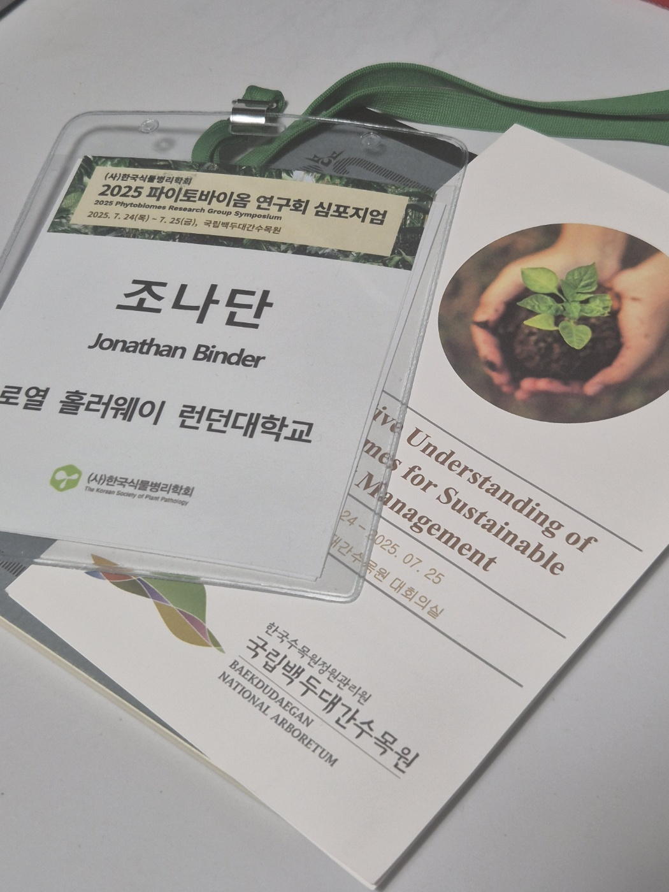

I attended my first conference in Korea (official language of conference: English) at the [Baekdudaegan National Arboretum
](https://www.bdna.or.kr/eng/intro){target="_blank"} hosted by the Phytobiome Research Group of the [Korean Plant Pathology Society](https://www.kspp.org/){target="_blank"}.

Invited speakers included Prof. Kenichi Tsuda (Huazhong Agricultural University) and Sora Yu (Lawrence Berkeley National Lab).
It was great to see organizers Prof. Junhyun Jeon and Prof. Kihyuck Choi make efforts to cultivate young researchers as well with additional presentations from graduate students and post-doctoral researchers.

I'm looking forward to the next meeting!

{width="90%" fig-alt="Name tag and symposium leaflet"}

<!--Include social share buttons-->


