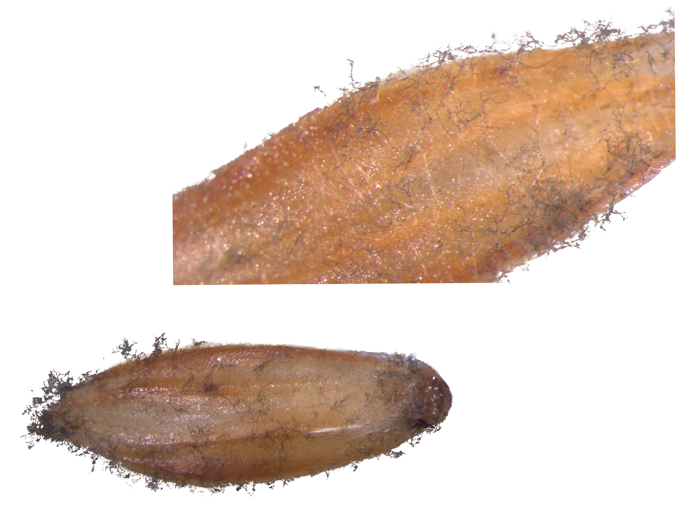
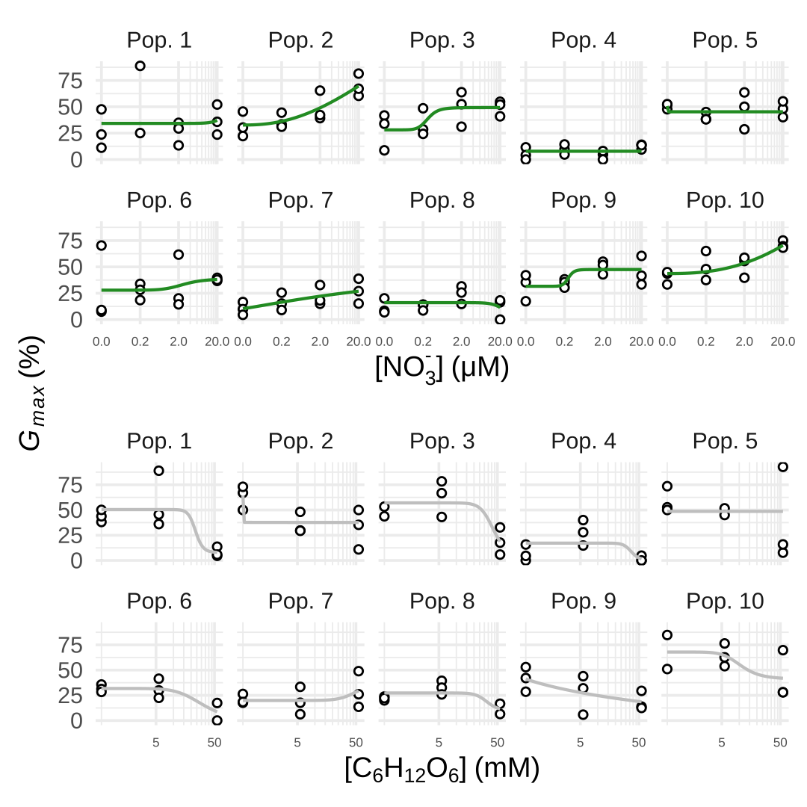

<!--Include academic icons or bottons-->



## Post-conference reflection

Although it was a long flight to and from Australia, it was an interesting and engaging conference.
Perth was a beautiful location and I was stunned by the unique local flora and fauna.
It was great to see old friends from the [Baekdudaegan National Arboretum](https://www.bdna.or.kr/eng/) and to learn about the agriculture research taking place at The University of Western Australia.
I was especially interested in their *Medicago* and subterranian clover breeding programs and their seed technology startup [Emergence Ecotech](https://www.uwa.edu.au/news/article/2025/september/emergence-ecotech).

 at the conference dinner.](./images/DSC_6028.jpg)

## Introduction

Nitrate ($\mathrm{NO_3^-}$) and glucose are present in soil and consumed by microorganisms.
These chemicals also act as seed germination signaling molecules [@alboresi2005; @price2003].
Understanding how seed-associated microorganisms mediate glucose and nitrate exposure or how glucose and nitrate levels shift microbial community structure and function could improve prediction of dormancy break, germination, or decay of weed seeds.
This experiment explored the relationships between microorganisms and germination of *Alopecurus myosuroides* (an economically-important weed) under various nitrate and glucose levels.

{#fig-fungi width="100%"}

## Methods

European seed populations up to 5 years old were obtained from Syngenta.

Dose-response germination assays were conducted in triplicate with nitrate (as $\mathrm{KNO_3}$) and glucose in Petri dishes with approximately 25 seeds at 20 °C and constant light in an environmental chamber.
Models were fit with four-parameter log-logistic functions.

DNA was isolated from dry seeds using the DNeasy PowerSoil Pro kit (Qiagen) and shotgun metagenomic sequencing was conducted on a subset of the populations in triplicate with a MinION Mk1b (Oxford Nanopore Technologies).
Nitrogen (N) cycling genes were identified using the NCycDB database [@tu2019] and pathogen microbiomes were classified using a eukaryotic pathogen database (EuPathDB-Clean) [@lu2018].

## Results

Seed populations showed varying sensitivities to nitrate and glucose (Fig. 2).

{#fig-dose}

N cycling-related gene expression of seed-associated microorganisms showed relatively similarity (Fig. 3) and there were no statistical differences in gene composition between populations (PERMANOVA, p=0.3). Pathogen metagenomes showed separation (Fig. 4) and metagenome compositions were different (PERMANOVA, p\<0.001).

{#fig-N}

{#fig-glucose}

## Discussion and Conclusion

Lack of differences in microbial N cycle gene compositions between populations suggests that seed microorganisms may not play an important role in seed responses to nitrate. While eukaryotic pathogen microbiomes were different between populations, additional analysis will be completed in an attempt to connect germination dynamics with microbial composition. Because $\mathrm{C_6H_{12}O_6}$ is a signalling molecule, use of non-signal carbon sources that may provide more fuel to pathogenic seed microorganisms may be better in elucidating seed microorganism effects. Taxonomic and differential abundance analyses will be used to further investigate these research question.

This experiment focused on seed-associated microorganisms in Petri dishes and ignored soil and soil microbial communities which may have a large effect on nutrient concentrations experienced by the seed.

Funding provided by:

## References
