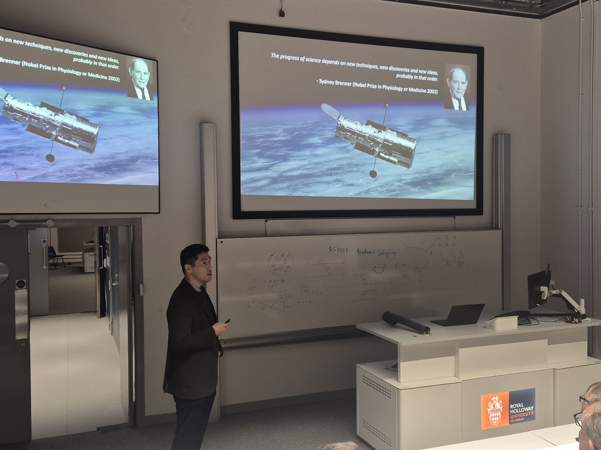

It was my pleasure to host Dr. Youngchan Kim, Lecturer in Quantum Biology in the School of Biosciences at the University of Surrey for the Biology Department departmental seminar. [Dr. Kim](https://scholar.google.com/citations?user=kq1_xHMAAAAJ&hl=en&oi=ao) joined Surrey at the same time as my wife so they knew each other and we happened to meet at the grocery store where we were introduced.

Dr. Kim's research is in the mind-bending realm of quantum principles where things behave not as you would suspect them to. His research has implications for how plants use light and there is also evidence that there are quantum effects on seed dormancy and germination.

> Progress in science depends on new techniques, new discoveries and new ideas, probably in that order.
> 
> -Sydney Brenner, Nobel Prize winner and pioneer in molecular biology

His talk and this quote, in particular, had me thinking about the ways that we can apply new technologies to old problems to gain insight and make discoveries.
The talk was well received and well attended.
I look forward to seeing the leaps and bounds Dr. Kim's research will take in the near future!

<!--Include social share buttons-->


