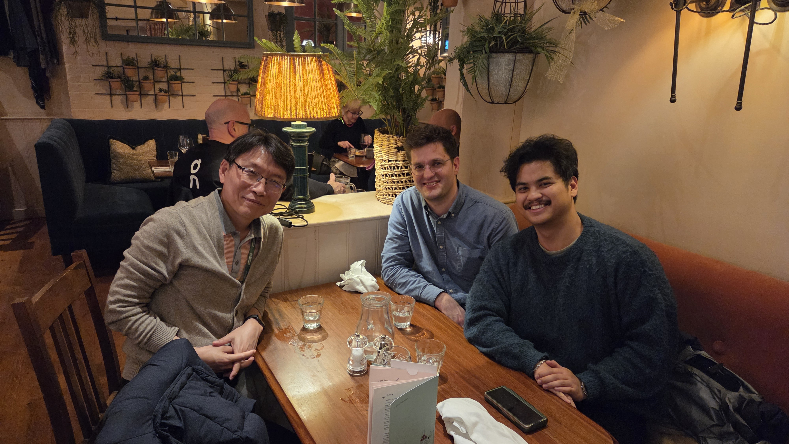

After having met at a conference in Korea in the summer, I was happy to host [Dr. Seung-Beom Hong](https://www.researchgate.net/profile/Seung-Beom-Hong-2), head of agricultural culture collections at South Korea's [National Institute of Crop and Food Science](https://www.nics.go.kr/english/index.do), for a quick tour of the campus and our lab.
He was joined by [Miguel Bonnin](https://scholar.google.com/citations?user=fZQZoj8AAAAJ&hl=en), a fellow PhD student who I had met at the beginning of my studies.

Dr. Hong is establishing a collaboration with CABI to establish a microbiome preservation project in Korea [@kim2024].
After the tour, Dr. Hong treated us to dinner and cask ale at the [Barley Mow](https://maps.app.goo.gl/Sk9BeRkahjsNeP1C7).

<!--Include social share buttons-->

