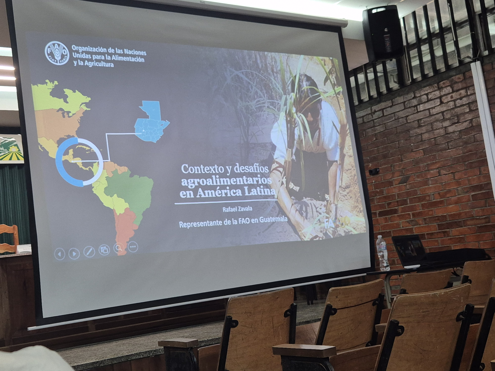
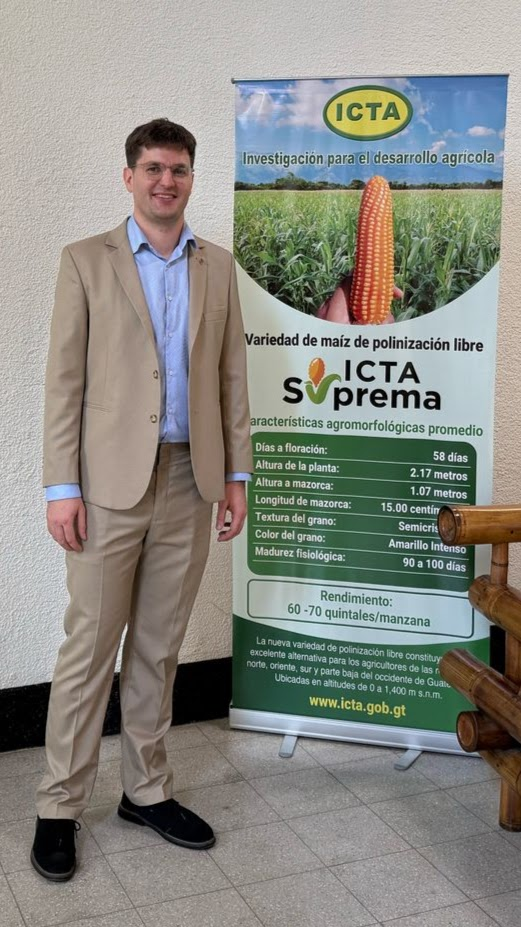
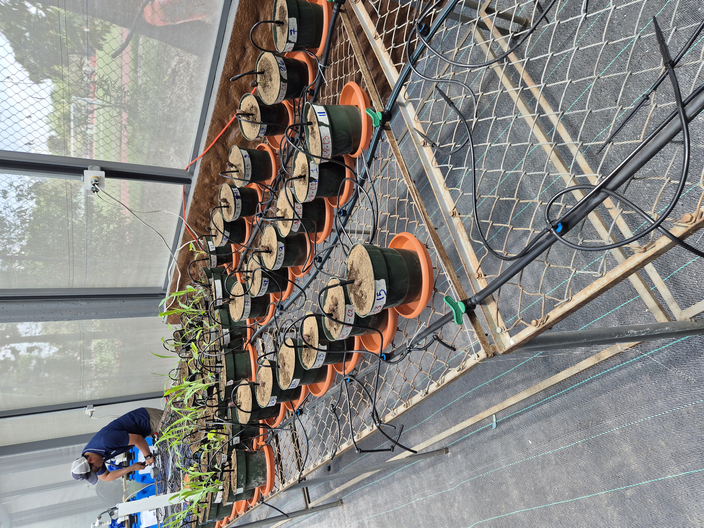
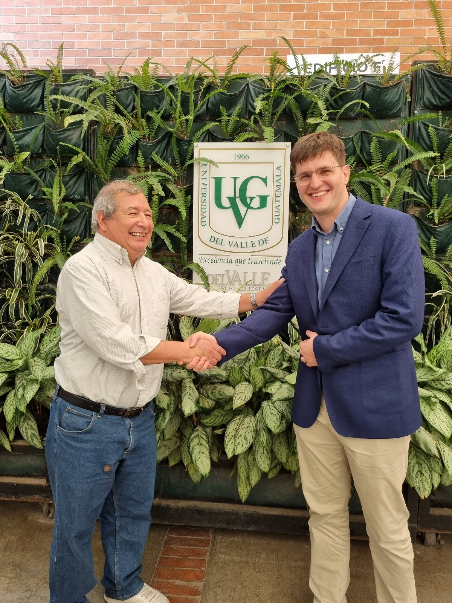

I was awarded official development assistance ([ODA](https://www.ukri.org/what-we-do/international-funding/applying-for-official-development-assistance-oda-funding/){target="_blank"}) funding to conduct a networking trip and visited the Institute of Agricultural Science and Technology ([ICTA](https://www.icta.gob.gt/){target="_blank"}) seed science team, [San Carlos University's agronomy department](http://fausac.gt/){target="_blank"} for a talk by the [FAO country director Rafael Zavala](https://www.fao.org/guatemala/fao-en-guatemala/es/){target="_blank"}, and University of the Valley of Guatemala to meet with Dr. Rolando Cifuentes, director of the [Center for Agricultural and Food Studies](https://www.uvg.edu.gt/investigacion/ceaa/){target="_blank"} and researcher Isabel Alonzo.

You can see my LinkedIn posts [1](https://www.linkedin.com/posts/jonathan-binder_the-first-stop-of-my-guatemala-networking-activity-7305575684893003778-84Tq?utm_source=share&utm_medium=member_desktop&rcm=ACoAABNghmQBCfkIj1Hs63ssN_qV1wy9CxRgZbA){target="_blank"}, [2](https://www.linkedin.com/posts/jonathan-binder_the-second-stop-on-my-guatemala-networking-activity-7306294417449992192-sIqU?utm_source=share&utm_medium=member_desktop&rcm=ACoAABNghmQBCfkIj1Hs63ssN_qV1wy9CxRgZbA){target="_blank"}, and [3](https://www.linkedin.com/posts/jonathan-binder_the-third-and-final-stop-of-my-guatemala-activity-7308042396179546114-S9E2?utm_source=share&utm_medium=member_desktop&rcm=ACoAABNghmQBCfkIj1Hs63ssN_qV1wy9CxRgZbA){target="_blank"}.

{group="my-gallery" fig-alt="Title slide for presentation"}

{group="my-gallery" fig-alt="Jonathan in a tan suit standing in front of banner for new maize variety produced by ICTA"}

{group="my-gallery" fig-alt="Pots in a greenhouse with tubes to each pot for fertigation"}

{group="my-gallery" fig-alt="Jonathan and Prof Cifuentes shaking hands and smiling in front of UVG banner"}

<!--Include social share buttons-->


